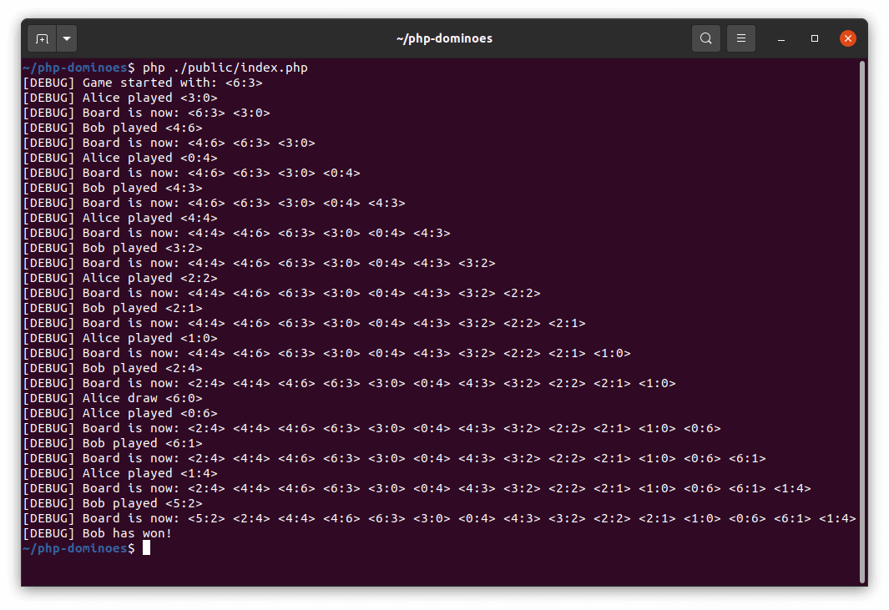

# php-dominoes

This is a [Dominoes](https://en.wikipedia.org/wiki/Dominoes) game that allows bots to play against each other.



## Getting Started

1. Clone the project
1. Install dependencies
   ```bash
   $ composer install
   ```
1. Execute the app (requires PHP 8)
   ```bash
   $ php ./public/index.php
   ```
   If your machine doesn't have PHP 8, you can use [Docker](https://docs.docker.com/get-docker/).
   ```bash
   $ docker-compose up
   ```

## About the project

- Only depends on [PHP PSR] standards.
- This is a modular project in which the [Dominoes] module is 100% covered with unit tests.
- No frameworks were used (besides [PHPUnit]).
- Only one external library:
  - [php-di/php-di]: For dependency injection.

## Code Architecture

- If you want to read and understand the code, you should start from the [\Console\Application] class.
- The whole game is managed by the [GameMediator] which provides all functionalities you would expect from a Dominoes
  game.
- The [LineOfPlay] holds all the placed tiles in the correct order and knows all the available connection spots for new
  tiles.
- The [RoundManager] decides who is the next to play.
- The [Bot] is any algorithm that can decide the next move a player should perform based on the current game situation.

## Test & Test Coverage

- Execute all tests.
  ```bash
  $ composer run test
  ```
- Generate the test coverage report in the directory `./test-coverage`.
  ```bash
  $ composer run test-coverage
  ```

## Glossary Terms Used in the Project

- **Tile**: The individual piece of a domino *deck*. It's divided in two sides, each side is called a *pip*.
- **Pip**: One of the two sides of a *tile*.
- **Line of play**: The array of *tiles* on the table upon which plays in the game are made.
- **Round**: Cycle of play in which each player must place a *tile* on the *line of play*, *draws*, or pass its turn.
- **Deck**: The complete batch of *tiles*, each one occurring exactly once, that is used to play Dominoes games.
- **Draw**: To transfer a *tile* from the *boneyard* to the player's hand.
- **Boneyard**: Set of *tiles* from which players *draw*.

## Rules of this Game

There are many types of [Dominoes games](https://en.wikipedia.org/wiki/List_of_domino_games). This game I implemented 
here is more close to the [Draw Domino Game](https://en.wikipedia.org/wiki/List_of_domino_games#Draw_Game). Find below 
the list of rules I followed for the game in this project.

- The players alternate turns to place a tile.
- A tile can only be placed next to another tile that has the same pip.
- If the player doesn't have a tile with a matching pip, he must draw a new tile until it finds one that matches.
  - If there are no more tiles to draw, the player passes its turn.
- The first player to empty his hand is the winner.
- If no player can place another tile and there are no more tiles to draw, the game is considered tied.

[PHP PSR]: https://www.php-fig.org/
[PHPUnit]: https://github.com/sebastianbergmann/phpunit/
[php-di/php-di]: https://github.com/PHP-DI/PHP-DI
[Dominoes]: src/Console
[Bot]: src/Dominoes/Bot/BotInterface.php
[GameMediator]: src/Dominoes/GameMediator/GameMediatorInterface.php
[LineOfPlay]: src/Dominoes/LineOfPlay/LineOfPlayInterface.php
[RoundManager]: src/Dominoes/RoundManager/RoundManagerInterface.php
[\Console\Application]: src/Console/Application.php


